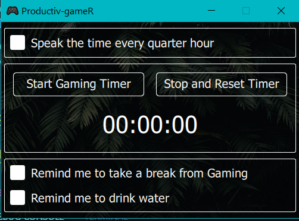
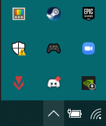

# What's Productiv-GameR?
Well, if you're like me, and absolutely LOVE gaming, but also find it eating away some of your productive time, then this app is for you! It's a pretty simple desktop app, which I mainly built to satisfy my curiousity about PyQt5 and QML.

## How do I download it?
Download from [this link](https://cdn.discordapp.com/attachments/788528253845241946/858266895089401896/Productiv-gameR.zip) and extract the contents into an empty folder, then run `Productiv-gameR.exe` and you're done!

## Features
It features 4 main options.
1. It speaks the time at regular intervals. This isn't decided by WHEN you launched the app. Rather, it speaks out the time at the 15th, 30th and 45th minute of any hour, as well as the beginning of the hour itself. This is achieved using the PyTTSx3 library
2. A gaming timer, to keep track of how long you have been gaming.
3. It reminds you every hour to take a break from the game by speaking it out loud (I hate apps that draw completely over other apps)
4. It reminds you at the 35th and 5th minute of every hour to hydrate yourself
5. It also shows in System Tray (Small arrow at bottom right in Windows), so it can run in background and not clutter up your taskbar

## How do I use it? (Using Repo)
First, clone the repo using `git clone https://github.com/mulitate4/Productiv-gameR main`. Then, open a command prompt in the directory, and use `pip install -r requirements.txt`. Then run `main.py`. I assume that you have already set up python, of course. I will also be trying to package it into a single app, so I can use it as a .exe!

## Will I use QML and PyQt5 again?
Probably not. There's not much point to it. Flutter already does this much better, so I would rather stick with Flutter for now. This was a very fun experience though, and had me banging my head quite some times. I learnt a lot and it stimulated my brain like nothing had in quite some while!
